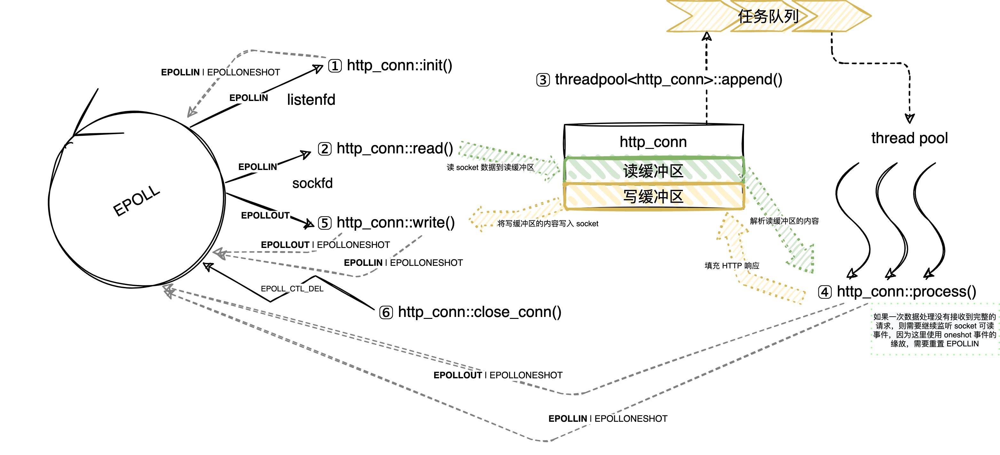

# 网络编程

## Linux 高性能服务器编程

### webserver

半同步/半反应堆并发模式的线程池，有限状态机模式的 HTTP 服务器，可通过 url 访问文件

#### 测试

1. g++ -pthread -o webserver http_conn.cpp webserver.cpp && ./webserver 127.0.0.1 12345
2. sudo mkdir -p /var/www/html && chmod 777 /var/www/html && echo "helloworld!" > /var/www/html/hw.html
3. 使用浏览器访问 http://127.0.0.1:12345/hw.html 可看到 helloworld! 字样

#### 整体架构



采用 ET + ONESHOT 模式：
1. 当一个 HTTP 请求到来的时候
2. 触发相应客户 socket 上的可写事件（EPOLLIN），将客户 socket 上的数据全部读取到读缓冲区 http_conn::m_read_buf 中
3. 并将当前用户对象 http_conn 加入到线程池到任务队列中，以触发工作线程的执行，执行用户对象 http_conn::process()
4. 工作线程解析读缓冲区中的数据
    - 如果此时读缓冲区中已包含完整的请求信息，则向写缓冲区  http_conn::m_write_buf 中填充响应信息，最后开始监听该用户 socket 上的可写事件（EPOLLOUT）
    - 如果此时读缓冲区中还没有包含完整的请求信息，则继续监听该用户 socket 上的可读事件（EPOLLIN），跳转到 1。因为 oneshot 事件的缘故，需要重置 EPOLLIN。
5. 监听到客户 socket 上的可写事件（EPOLLOUT），将写缓冲区中的响应信息写入到客户socket。
    - 如果一次写入不能写入所有响应信息，还需要重置 EPOLLOUT，跳转到 5
6. 写入完成后，判断是否使用长连接，是则初始化请求对象并重置 EPOLLIN，否则关闭 socket 连接

## Linux 多线程服务端编程

### 测试

使用 make 编译 `/test` 下的所有测试用例。

日志输出级别的初始化依赖环境变量，且默认的输出级别为 `DEBUG`，会看不到 `TRACE` 的日志信息，可以在通过在运行测试程序前修改环境变量更改默认日志输出级别。

``` shell
# 改变初始的输出级别为 TRACE
export JMUDUO_LOG_TRACE=
# 恢复默认的 DEBUG
unset JMUDUO_LOG_TRACE
```